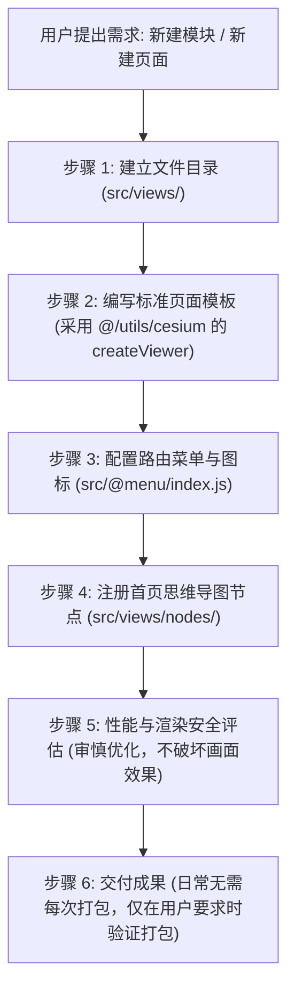

# Gisnotes-CS 模块与页面开发规范工作流

本 Skill 规范了在 `gisnotes-cs` 项目中新增模块、新建页面、配置侧边栏菜单及联动首页思维导图的标准流程。

---

## 核心开发步骤概览



---

## 1. 模块与页面创建规范

### 1.1 生成模块 (Module)
当用户提出**“生成一个模块”**或**“新建一个一级分类”**时：
- 在 `src/views/` 路径下新建对应的模块英文名称空文件夹（如 `src/views/material`、`src/views/camera`、`src/views/spaceAnalysis` 等）。

### 1.2 新建页面 (Page)
当用户提出**“新建一个页面”**或**“添加某个示例”**时：
- 在对应模块的文件夹下新建一个子文件夹（以小驼峰命名，如 `cameraControl`、`gradientMaterial`、`overlayAnalysis`）；
- 在该子文件夹内新建 `index.vue` 文件（路径结构形如：`src/views/<模块名>/<页面名>/index.vue`）。

### 1.3 标准页面模板与 Viewer 创建规范 (`index.vue`)
本项目页面均为结合 **Cesium** 的可视化与三维空间分析示例。引入并创建 `Viewer` 对象必须严格遵循以下规则，参考标准范例（如 [src/views/camera/cameraVisualization/index.vue](file:///d:/Users/Downloads/gisnotes-cs/src/views/camera/cameraVisualization/index.vue)）：

> [!IMPORTANT]
> **新页面默认初始模板规范（Viewer 与 CustomGUI 必须默认齐备）：**
> 1. **默认加 Viewer 对象**：每次新建页面时，即使用户尚未提及具体功能，**必须默认初始化一个标准 Viewer 对象**。创建 `Viewer` 统一调用 `@/utils/cesium.js` 导出的 `createViewer` 和 `optimizeViewerQuality` 方法（严禁原生 `new Cesium.Viewer()` 构造，严禁挂载全局 `window.viewer = viewer`）；
> 2. **默认初始化空的 CustomGUI 组件**：每次新建页面时，**必须默认引入并初始化一个空的控制面板组件**（统一使用 `@/utils/gui.js` 导出的 `CustomGUI` 类：`gui = new CustomGUI({ container: viewerDivRef.value, title: "控制面板" })`），挂载于当前地图容器上备用；
> 3. **完整生命周期销毁**：在组件卸载钩子 `onBeforeUnmount` 中，必须显式调用 `gui?.destroy()` 与 `viewer?.destroy()` 释放所有资源。

**标准页面模板结构：**
```vue
<template>
  <demo-box :codeBlocks="codeBlocks">
    <div class="box" ref="viewerRef"></div>
  </demo-box>
</template>

<script setup name="<PascalCase页面名>">
import DemoBox from "@/components/DemoBox/index.vue";
import IndexSourceCode from "./index.vue?raw";
import CesiumSourceCode from "@/utils/cesium.js?raw";

import Cesium from "cesium";
import "cesium/Build/CesiumUnminified/Widgets/widgets.css";
import { createViewer, optimizeViewerQuality } from "@/utils/cesium";
import { CustomGUI } from "@/utils/gui";

// 代码查看器配置（注意：按项目规范，默认不包含 gui.js）
const codeBlocks = ref([
  {
    fileName: "@/views/<模块名>/<页面名>/index.vue",
    rawCode: IndexSourceCode,
    language: "html",
  },
  {
    fileName: "@/utils/cesium.js",
    rawCode: CesiumSourceCode,
    language: "javascript",
  },
]);

const viewerDivRef = useTemplateRef("viewerRef");
let viewer = null;
let timer = null;
let gui = null;

onMounted(() => {
  timer = setTimeout(() => {
    init();
  }, 0);
});

function init() {
  // 1. 使用 utils 包下的 createViewer 创建通用 Viewer（严禁 window.viewer = viewer）
  viewer = createViewer(viewerDivRef.value, {
    shadows: true,
  });

  // 2. 开启抗锯齿与高清渲染
  optimizeViewerQuality(viewer, { msaaSamples: 4, enableFxaa: false });

  // 3. 业务初始化逻辑...

  // 4. 初始化控制面板
  initGUI();
}

function initGUI() {
  gui = new CustomGUI({
    container: viewerDivRef.value,
    title: "控制面板",
  });
  // 增加相关控制 folder...
}

onBeforeUnmount(() => {
  if (timer) clearTimeout(timer);
  if (gui) {
    gui.destroy();
    gui = null;
  }
  if (viewer) {
    viewer.destroy();
    viewer = null;
  }
});
</script>

<style lang="scss" scoped>
.box {
  width: 100%;
  height: 100%;
  position: absolute;
  inset: 0;
}
</style>
```

---

## 2. 菜单路由与图标配置规范 (`src/@menu/index.js`)

在 `src/@menu/index.js` 的 `LOCAL_ROUTES` 数组中添加对应的层级路由：

### 2.1 路由层级配置
- **一级菜单（模块）**：
  - `name`: 模块大驼峰名称（如 `"Material"`, `"Camera"`, `"SpaceAnalysis"`）
  - `path`: `"/<模块名>"`
  - `component`: `"Layout"`
  - `alwaysShow`: `true`
  - `meta`: `{ title: "模块中文名", icon: "图标名称", roles: ["admin"] }`
- **二级菜单（页面）**：
  - `path`: `"<页面名>"`
  - `component`: `"<模块名>/<页面名>/index"`
  - `name`: 页面大驼峰名称（如 `"GradientMaterial"`, `"OverlayAnalysis"`）
  - `meta`: `{ title: "页面中文名", icon: "图标名称", roles: ["admin"] }`

### 2.2 图标默认值与 Iconfont 在线图标处理规则
1. **默认图标分配**：
   - 生成代码或新建菜单时，若用户尚未提供指定图标，系统先**默认提供一个语义相符的图标名称**（如 `galaxy`、`component`、`color`、`zhaoxiangji`、`2dmap`、`guide` 等），确保菜单与页面能够第一时间完整正常展示。
2. **Iconfont 在线图标优先判定**：
   - **除非用户特别指明是本地 SVG 图标文件（位于 `src/assets/icons/svg/`），否则用户提供给我们的所有图标名称默认均作为 iconfont 在线图标名称处理**（例如 `zhaoxiangji`、`erweiditu`、`jiheti`、`ying_eagle`、`icon-dilikongjianfenxi`、`icon-diejiafenxi` 等）。
3. **精准修改更新**：
   - 后续当用户明确指定具体图标时，直接在 `src/@menu/index.js` 对应一级/二级菜单项的 `meta.icon` 中精确修改更新为用户给出的图标名称。

**路由配置示例：**
```javascript
{
  name: "SpaceAnalysis",
  path: "/spaceAnalysis",
  hidden: false,
  redirect: "noRedirect",
  component: "Layout",
  alwaysShow: true,
  meta: { title: "空间分析", icon: "icon-dilikongjianfenxi", roles: ["admin"] },
  children: [
    {
      path: "overlayAnalysis",
      component: "spaceAnalysis/overlayAnalysis/index",
      name: "OverlayAnalysis",
      hidden: false,
      meta: { title: "叠加分析", icon: "icon-diejiafenxi", roles: ["admin"] },
    },
  ],
}
```

---

## 3. 首页思维导图脑图联动规范 (`src/views/nodes/`)

项目首页 `src/views/index.vue` 使用 **jsMind** 自动渲染所有示例的思维导图目录，必须保持同步配置。

### 3.1 创建/更新模块分支文件 (`src/views/nodes/<模块名>.js`)
在 `src/views/nodes/` 目录下新建对应模块的节点定义文件（如 `spaceAnalysis.js`）：

```javascript
import { STATUS } from "./constants";

export const SPACE_ANALYSIS_NODES = [
  {
    id: "space_analysis_1",
    topic: "叠加分析",
    status: STATUS.DONE,
    route: "/spaceAnalysis/overlayAnalysis",
  },
];
```

> **状态定义说明**：
> - `STATUS.DONE`: 已完成（节点显示绿色背景，支持点击自动跳转路由页面）
> - `STATUS.TODO`: 待开发（节点显示未完成状态）

### 3.2 注册到总节点索引 (`src/views/nodes/index.js`)
在 `src/views/nodes/index.js` 中引入并加入到 `NODE_GROUPS` 和 `ALL_NODES`：

```javascript
import { STATUS } from "./constants";
import { VIEW_NODES } from "./view";
import { GEOMETRIES_NODES } from "./geometries";
import { TILE3D_NODES } from "./tile3d";
import { CAMERA_NODES } from "./camera";
import { MATERIAL_NODES } from "./material";
import { SPACE_ANALYSIS_NODES } from "./spaceAnalysis"; // 1. 引入新模块节点

export { STATUS };

export const NODE_GROUPS = [
  { id: "view", topic: "地图视图", nodes: VIEW_NODES },
  { id: "geometries", topic: "几何体绘制", nodes: GEOMETRIES_NODES },
  { id: "3dtile", topic: "3DTiles", nodes: TILE3D_NODES },
  { id: "camera", topic: "相机", nodes: CAMERA_NODES },
  { id: "material", topic: "材质", nodes: MATERIAL_NODES },
  { id: "spaceAnalysis", topic: "空间分析", nodes: SPACE_ANALYSIS_NODES }, // 2. 注册为一级分支
];

export const ALL_NODES = [
  ...VIEW_NODES,
  ...GEOMETRIES_NODES,
  ...TILE3D_NODES,
  ...CAMERA_NODES,
  ...MATERIAL_NODES,
  ...SPACE_ANALYSIS_NODES, // 3. 注册到全局路由事件监听
  ...MODEL3D_NODES,
];
```

---

## 4. 关键排错与避坑指南

1. **新建目录后的热重载**：
   在开发模式下，新建一级模块目录后，如点击菜单未立即生效，需提醒用户按 `F5` 刷新页面以让 Vite 的 `import.meta.glob` 重新扫描最新目录。
2. **代码块查看规范**：
   按项目统一约定，`codeBlocks` 中默认**不添加** `{ fileName: "@/utils/gui.js", ... }`，仅保留当前页源码、自定义抽取模块及 `@/utils/cesium.js`。
3. **材质与属性变更防闪烁**：
   自定义材质属性在动态变更 Uniform 数据时，直接在 setter 中赋值，**切勿触发 `this._definitionChanged.raiseEvent()`**，避免 Cesium 销毁并重建三维几何网格导致画面忽闪。
4. **统一使用 `@/utils/cesium.js` 的 `createViewer`**：
   新建 Cesium 页面示例时，必须统一导入并使用 `@/utils/cesium.js` 中的 `createViewer` 和 `optimizeViewerQuality` 方法初始化，不要手写 `new Cesium.Viewer`；且严禁将实例挂载到 `window.viewer`。
5. **日常无需每次全量打包验证**：
   日常开发生成或修改代码后，**默认无需每次执行 `pnpm run build:prod` 全量打包编译**；仅当用户明确指示“打包”、“构建”或“验证构建”时才执行打包命令，以保证交互的高效与迅速。
6. **默认集成基础 Viewer 与空 CustomGUI**：
   当用户要求新建页面且未说明具体功能时，必须默认调用 `@/utils/cesium.js` 的 `createViewer` 和 `optimizeViewerQuality` 初始化标准 Viewer，并统一引入 `@/utils/gui.js` 的 `CustomGUI` 实例化空的控制面板（`gui = new CustomGUI({ container: viewerDivRef.value, title: "控制面板" })`），挂载在左上角并支持卸载清理，方便后续快速扩展控制项。

---

## 5. 性能优化原则与渲染安全评估指南

在对 Cesium 页面进行性能优化时，**必须首先评估该优化策略是否会对页面的正常渲染产生副作用**，严守“**优化不减效、加速不毁画**”的底线：

### 5.1 渲染模式优化与安全性评估 (`requestRenderMode`)
- **适用场景**：静态地图、纯矢量/几何分析、图层开关等无连续逐帧动画的页面。开启后 GPU 占用可由 100% 降至 0%，彻底解决风扇狂转与发热问题：
  ```javascript
  viewer.scene.requestRenderMode = true;
  viewer.scene.maximumRenderTimeChange = Infinity;
  ```
- ⚠️ **渲染安全红线**：
  1. **动态效果冲突**：若页面包含粒子系统、流向线/雷达扫描纹理、实体漫游轨迹、视频贴图等**持续动画**，开启 `requestRenderMode` 会导致画面彻底冻结！此类场景**严禁开启**或必须自行在 `scene.postRender` / `tick` 中触发 `requestRender()`；
  2. **交互重绘联动**：开启按需渲染后，所有异步数据加载完成（如异步地形、GeoJSON 加载）及 GUI 参数修改（颜色、透明度、图层显隐）回调末尾，**必须显式调用 `viewer.scene.requestRender()`**，否则界面将无法即时响应更新。

### 5.2 依赖库打包体积优化（Tree-Shaking）
- **规范**：禁止全量导入庞大 GIS 算法库（如禁止 `import * as turf from "@turf/turf"`）；必须采用具名按需导入（如 `import { intersect, area } from "@turf/turf"`）。
- **渲染安全评估**：纯打包期静态分析与代码消除，**100% 不改变运行时逻辑和画面渲染**，属于零风险、高收益优化。

### 5.3 抗锯齿与图像质量权衡
- **规范**：推荐开启硬件级 WebGL2 原生 `msaaSamples: 4`，关闭额外的后处理 `enableFxaa: false`：
  ```javascript
  optimizeViewerQuality(viewer, { msaaSamples: 4, enableFxaa: false });
  ```
- **渲染安全评估**：
  - MSAA 针对几何图元边缘采样极为干净锐利；
  - 避免叠加 FXAA 后处理 pass 导致的细线与文字“糊焦”现象，同时降低 GPU 片元着色器压力；
  - 仅在旧版 WebGL1 或需大面积处理软边透明贴图融合时才按需回退为 FXAA。

### 5.4 轻量化渲染图元与对象复用
- **规范**：对于单次空间计算产生的结果面/线，优先直接提取经纬度数组赋给单个 `Entity` 或 `Primitive`，避免动辄实例化整个庞大的 `GeoJsonDataSource`。
- **渲染安全评估**：
  - ⚠️ **几何完整性校验**：手动解析坐标时必须兼顾 `Polygon`（外环+内环镂空洞）与 `MultiPolygon`（多块组合体），确保空间多边形不缺失、不畸变，与原始计算结果保持 100% 一致。
