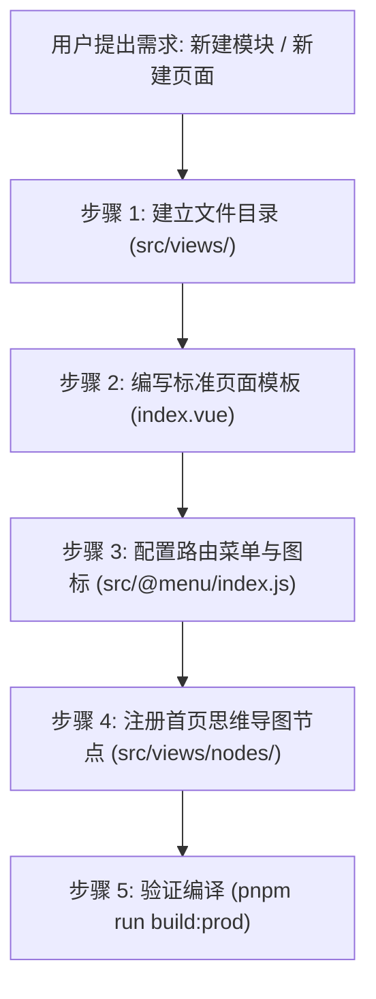

# Gisnotes-CS 模块与页面开发规范工作流

本 Skill 规范了在 `gisnotes-cs` 项目中新增模块、新建页面、配置侧边栏菜单及联动首页思维导图的标准流程。

---

## 核心开发步骤概览



---

## 1. 模块与页面创建规范

### 1.1 生成模块 (Module)
当用户提出**“生成一个模块”**或**“新建一个一级分类”**时：
- 在 `src/views/` 路径下新建对应的模块英文名称空文件夹（如 `src/views/material`、`src/views/camera` 等）。

### 1.2 新建页面 (Page)
当用户提出**“新建一个页面”**或**“添加某个示例”**时：
- 在对应模块的文件夹下新建一个子文件夹（以小驼峰命名，如 `cameraControl`、`gradientMaterial`）；
- 在该子文件夹内新建 `index.vue` 文件（路径结构形如：`src/views/<模块名>/<页面名>/index.vue`）。

### 1.3 标准页面模板结构 (`index.vue`)
新建的 `index.vue` 必须保持项目的统一规范：
```vue
<template>
  <demo-box :codeBlocks="codeBlocks">
    <div class="box" ref="viewerRef"></div>
  </demo-box>
</template>

<script setup name="<PascalCase页面名>">
import DemoBox from "@/components/DemoBox/index.vue";
import IndexSourceCode from "./index.vue?raw";
import CesiumSourceCode from "@/utils/cesium.js?raw";

import Cesium from "cesium";
import "cesium/Build/CesiumUnminified/Widgets/widgets.css";
import { createViewer, optimizeViewerQuality } from "@/utils/cesium";
import { CustomGUI } from "@/utils/gui";

// 代码查看器配置（注意：按项目规范，默认不包含 gui.js）
const codeBlocks = ref([
  {
    fileName: "@/views/<模块名>/<页面名>/index.vue",
    rawCode: IndexSourceCode,
    language: "html",
  },
  {
    fileName: "@/utils/cesium.js",
    rawCode: CesiumSourceCode,
    language: "javascript",
  },
]);

const viewerDivRef = useTemplateRef("viewerRef");
let viewer = null;
let timer = null;
let gui = null;

onMounted(() => {
  timer = setTimeout(() => {
    init();
  }, 0);
});

function init() {
  // 1. 创建通用 Cesium Viewer
  viewer = createViewer(viewerDivRef.value, {
    shadows: true,
  });

  // 2. 开启抗锯齿与高清渲染
  optimizeViewerQuality(viewer, { msaaSamples: 4, enableFxaa: true });

  // 3. 业务初始化逻辑...

  // 4. 初始化控制面板
  initGUI();
}

function initGUI() {
  gui = new CustomGUI({
    container: viewerDivRef.value,
    title: "控制面板",
  });
  // 增加相关控制 folder...
}

onBeforeUnmount(() => {
  if (timer) clearTimeout(timer);
  if (gui) {
    gui.destroy();
    gui = null;
  }
  if (viewer) {
    viewer.destroy();
    viewer = null;
  }
});
</script>

<style lang="scss" scoped>
.box {
  width: 100%;
  height: 100%;
  position: absolute;
  inset: 0;
}
</style>
```

---

## 2. 菜单路由与图标配置规范 (`src/@menu/index.js`)

在 `src/@menu/index.js` 的 `LOCAL_ROUTES` 数组中添加对应的层级路由：

### 2.1 路由层级配置
- **一级菜单（模块）**：
  - `name`: 模块大驼峰名称（如 `"Material"`, `"Camera"`）
  - `path`: `"/<模块名>"`
  - `component`: `"Layout"`
  - `alwaysShow`: `true`
  - `meta`: `{ title: "模块中文名", icon: "图标名称", roles: ["admin"] }`
- **二级菜单（页面）**：
  - `path`: `"<页面名>"`
  - `component`: `"<模块名>/<页面名>/index"`
  - `name`: 页面大驼峰名称（如 `"GradientMaterial"`）
  - `meta`: `{ title: "页面中文名", icon: "图标名称", roles: ["admin"] }`

### 2.2 图标默认值与 Iconfont 在线图标处理规则
1. **默认图标分配**：
   - 生成代码或新建菜单时，若用户尚未提供指定图标，系统先**默认提供一个语义相符的图标名称**（如 `galaxy`、`component`、`color`、`zhaoxiangji`、`2dmap`、`guide` 等），确保菜单与页面能够第一时间完整正常展示。
2. **Iconfont 在线图标优先判定**：
   - **除非用户特别指明是本地 SVG 图标文件（位于 `src/assets/icons/svg/`），否则用户提供给我们的所有图标名称默认均作为 iconfont 在线图标名称处理**（例如 `zhaoxiangji`、`erweiditu`、`jiheti`、`ying_eagle`、`3Dkeshiyufenxi` 等）。
3. **精准修改更新**：
   - 后续当用户明确指定具体图标时，直接在 `src/@menu/index.js` 对应一级/二级菜单项的 `meta.icon` 中精确修改更新为用户给出的图标名称。

**路由配置示例：**
```javascript
{
  name: "Material",
  path: "/material",
  hidden: false,
  redirect: "noRedirect",
  component: "Layout",
  alwaysShow: true,
  meta: { title: "材质", icon: "color", roles: ["admin"] },
  children: [
    {
      path: "changeColor",
      component: "material/changeColor/index",
      name: "ChangeColor",
      hidden: false,
      meta: { title: "变更颜色", icon: "color", roles: ["admin"] },
    },
    {
      path: "gradientMaterial",
      component: "material/gradientMaterial/index",
      name: "GradientMaterial",
      hidden: false,
      meta: { title: "渐变色材质", icon: "color", roles: ["admin"] },
    },
  ],
}
```

---

## 3. 首页思维导图脑图联动规范 (`src/views/nodes/`)

项目首页 `src/views/index.vue` 使用 **jsMind** 自动渲染所有示例的思维导图目录，必须保持同步配置。

### 3.1 创建/更新模块分支文件 (`src/views/nodes/<模块名>.js`)
在 `src/views/nodes/` 目录下新建对应模块的节点定义文件（如 `material.js`）：

```javascript
import { STATUS } from "./constants";

export const MATERIAL_NODES = [
  {
    id: "material_1",
    topic: "变更颜色",
    status: STATUS.DONE,
    route: "/material/changeColor",
  },
  {
    id: "material_2",
    topic: "渐变色材质",
    status: STATUS.DONE,
    route: "/material/gradientMaterial",
  },
];
```

> **状态定义说明**：
> - `STATUS.DONE`: 已完成（节点显示绿色背景，支持点击自动跳转路由页面）
> - `STATUS.TODO`: 待开发（节点显示未完成状态）

### 3.2 注册到总节点索引 (`src/views/nodes/index.js`)
在 `src/views/nodes/index.js` 中引入并加入到 `NODE_GROUPS` 和 `ALL_NODES`：

```javascript
import { STATUS } from "./constants";
import { VIEW_NODES } from "./view";
import { GEOMETRIES_NODES } from "./geometries";
import { TILE3D_NODES } from "./tile3d";
import { MATERIAL_NODES } from "./material"; // 1. 引入新模块节点

export { STATUS };

export const NODE_GROUPS = [
  { id: "view", topic: "地图视图", nodes: VIEW_NODES },
  { id: "geometries", topic: "几何体绘制", nodes: GEOMETRIES_NODES },
  { id: "3dtile", topic: "3DTiles", nodes: TILE3D_NODES },
  { id: "material", topic: "材质", nodes: MATERIAL_NODES }, // 2. 注册为一级分支
];

export const ALL_NODES = [
  ...VIEW_NODES,
  ...GEOMETRIES_NODES,
  ...TILE3D_NODES,
  ...MATERIAL_NODES, // 3. 注册到全局路由事件监听
];
```

---

## 4. 关键排错与避坑指南

1. **新建目录后的热重载**：
   在开发模式下，新建一级模块目录后，如点击菜单未立即生效，需提醒用户按 `F5` 刷新页面以让 Vite 的 `import.meta.glob` 重新扫描最新目录。
2. **代码块查看规范**：
   按项目统一约定，`codeBlocks` 中默认**不添加** `{ fileName: "@/utils/gui.js", ... }`，仅保留当前页源码、自定义抽取模块及 `@/utils/cesium.js`。
3. **材质与属性变更防闪烁**：
   自定义材质属性在动态变更 Uniform 数据时，直接在 setter 中赋值，**切勿触发 `this._definitionChanged.raiseEvent()`**，避免 Cesium 销毁并重建三维几何网格导致画面忽闪。
