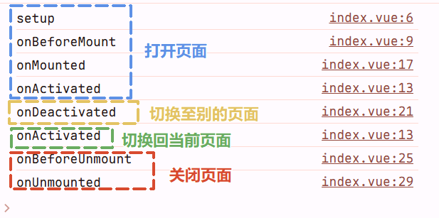
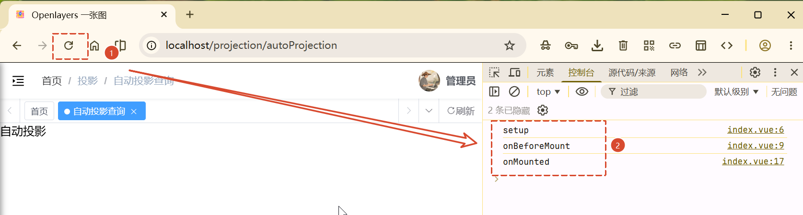
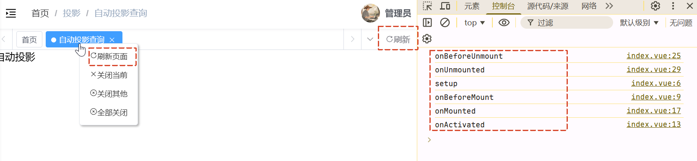
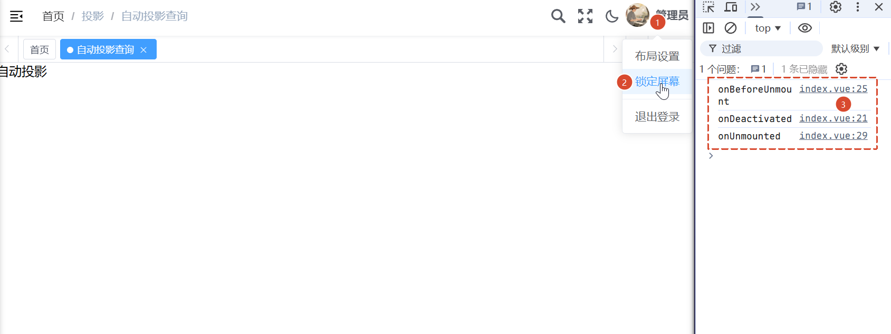
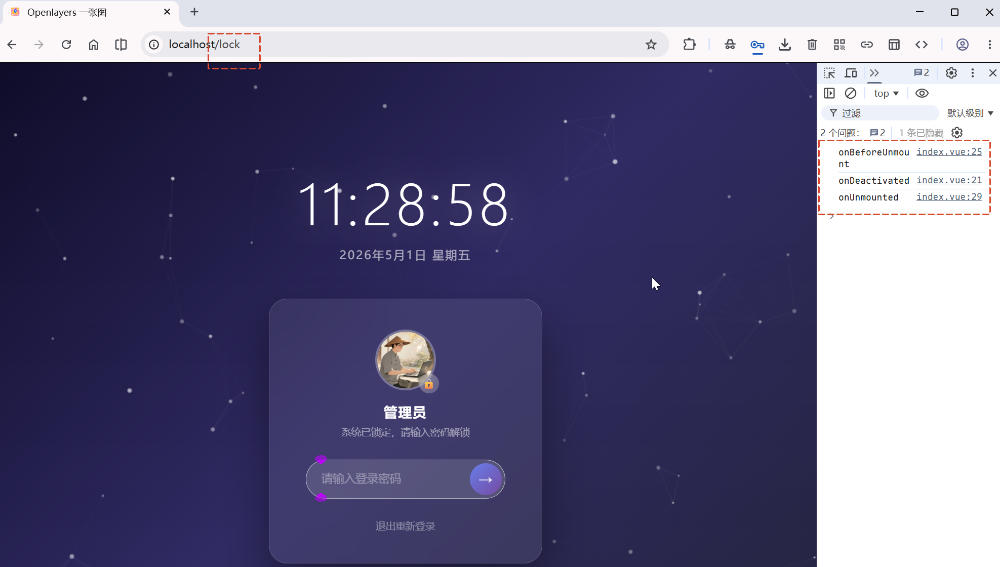
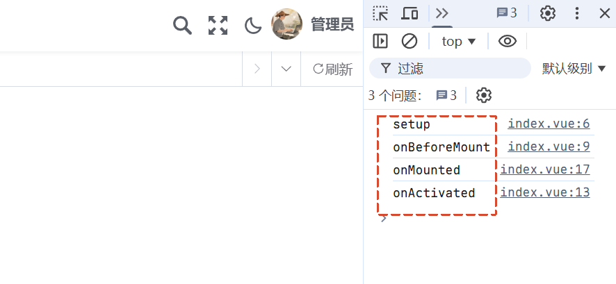

> **声明**：本项目基于 [RuoYi-Vue3](https://github.com/yangzongzhuan/RuoYi-Vue3) 框架修改而来，用于学习和研究 Cesium 官方示例或源代码之用。

## 项目下载及初始化

> 注：推荐使用 node 的 24 版本来安装或运行项目，这里我使用的 node 版本是`24.12.0`。

```shell
git clone https://github.com/gisnotes/gisnotes-cs.git

cd gisnotes-cs

npm install
# 或者
pnpm install

npm run dev
# 或者
pnpm dev
```

## 开启标签页缓存

我们新建一个页面，测试代码如下所示：在script标签上增加一个name属性，这样这个页面便可以被缓存。

```vue
<template>
  <div class="auto-projection">自动投影</div>
</template>

<script setup name="AutoProjection">
console.log("setup");

onBeforeMount(() => {
  console.log("onBeforeMount");
});

onActivated(() => {
  console.log("onActivated");
});

onMounted(() => {
  console.log("onMounted");
});

onDeactivated(() => {
  console.log("onDeactivated");
});

onBeforeUnmount(() => {
  console.log("onBeforeUnmount");
});

onUnmounted(() => {
  console.log("onUnmounted");
});
</script>
```

然后接下来我们将打印一下页面从被打开到关闭执行的生命周期情况：打开页面-->切换到别的标签页-->切换回当前页面-->关闭页面，打印的日志如下图所示：



然后针对一些特殊情况，比如：

1. 点击浏览器的刷新按钮，打印的日志如下图所示：



2. 但是，右键单击标签并点击刷新菜单，或者**直接点击标签栏最右侧的刷新按钮**，打印的日志如下图所示：



3. 我们点击锁定屏幕后，打印的日志如下图所示：

> 锁屏的密码和登录的密码一样，都是`admin123`。



进入锁屏界面后则会进入lock页面，路由也发生了变化：



解锁后，则会回到锁屏前的界面，打印的日志如下图所示：会重新从头执行生命周期。



### 分析原因

我们来分析一下，在`AppMain.vue`中，你的页面被`<keep-alive>`包裹：

```vue
<keep-alive :include="tagsViewStore.cachedViews">
  <component v-if="!route.meta.link" :is="Component" :key="route.path"/>
</keep-alive>
```

AutoProjection 组件的 meta.noCache 是默认 false ，所以它会被加入 cachedViews 并被 keep-alive 缓存。

```js
addCachedView(view) {
  if (this.cachedViews.includes(view.name)) return
  if (!view.meta.noCache) {
    this.cachedViews.push(view.name)
  }
}
```

总结一下就是，缓存页面生命周期执行顺序如下：

| 场景                   | 生命周期执行顺序                                        |
| ---------------------- | ------------------------------------------------------- |
| 首次进入               | `setup` → `onBeforeMount` → `onMounted` → `onActivated` |
| 再次进入（缓存命中）   | `onActivated` （不再触发 `onMounted`）                  |
| 离开                   | `onDeactivated`                                         |
| 销毁（从缓存中移除后） | `onDeactivated` → `onBeforeUnmount` → `onUnmounted`     |

### 代码层面的追踪路径

整个流程的调用链是：

- permission.js:L59-L62 — 路由守卫中调用 generateRoutes() 注册动态路由
- TagsView/index.vue:L102 — 监听 route 变化，调用 addTags()
- tagsView\.js:L40-L42 — addCachedView() 将 "AutoProjection" 推入 cachedViews 数组
- AppMain.vue:L4 — <keep-alive> 的 :include 匹配到组件名，触发缓存
- 组件首次挂载 → onMounted 执行 → Vue 内部完成缓存 → onActivated 执行
